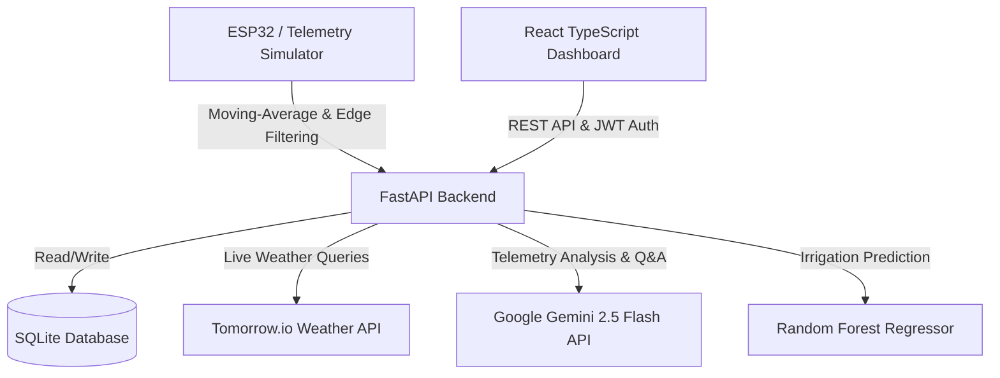

# Smart Agri-Monitor & Optimization System

An IoT-powered precision irrigation and soil health monitoring platform. This system utilizes ESP32 edge processing telemetry buffers, a FastAPI backend (featuring JWT authentication, time-series data modeling, and a Random Forest irrigation scheduler), real-time Tomorrow.io weather forecasts, a Gemini 2.5 Flash AI Agronomic Advisor, and a stark brutalist React/TypeScript dashboard displaying high-performance metrics.

---

## 🏗️ System Architecture



---

## 🌟 Key Features

1. **Edge-Filtered Telemetry**: Moving-average filter (window = 10 samples) runs at the edge to reduce ambient sensor noise before transmission.
2. **Adaptive Anomaly Alerts**: Rapid soil moisture depletion, high temperatures, or acidic/alkaline pH level spikes trigger immediate edge anomaly alerts.
3. **ML-Driven Irrigation Schedules**: Random Forest regressor schedules optimal watering durations by evaluating current soil profiles alongside a 3-day precipitation forecast.
4. **Tomorrow.io Live Weather**: Real-world weather integration replaces static mocks to gauge exact local temperatures, humidity, and cloud covers.
5. **Gemini AI Agronomic Advisor**: Generates live, context-aware soil assessments and answers operator inquiries (e.g. crop suitability, soil neutralization remedies) directly from dashboard metrics.

---

## ⚙️ Mathematical & Algonomic Design

### 1. Edge Moving-Average Filtering
To filter out noise from low-cost analog moisture and pH sensors, the ESP32 firmware manages a circular buffer of the last 10 readings ($N=10$):
$$\overline{x} = \frac{1}{N} \sum_{i=1}^{N} x_i$$
If an anomaly is detected (outside baseline thresholds), it is pushed immediately to skip standard transmission throttling.

### 2. Reference Evapotranspiration ($ET_0$)
The irrigation model computes soil moisture depletion rates using a simplified Hargreaves/Penman-Monteith equation based on current temperature ($T$), relative humidity ($RH$), and solar radiation ($R_a$):
$$ET_0 = 0.0018 \cdot (T + 17.8) \cdot \sqrt{R_a} \cdot \left(1.0 - \frac{RH}{100.0}\right)$$
Water loss coordinates drive our predictive engine to adjust watering schedules.

---

## 🚀 Setup & Execution Guide

### Prerequisite API Keys
To enable live weather and AI advisory panels, retrieve and configure:
1. **Google Gemini API Key**: Obtain from [Google AI Studio](https://aistudio.google.com/).
2. **Tomorrow.io API Key**: Obtain from the [Tomorrow.io Development Portal](https://app.tomorrow.io/).

---

### 1. Backend Server Setup
The backend runs on Python 3.x using FastAPI and SQLite.

```bash
cd backend

# Create & activate virtual environment (if not already present)
python3 -m venv venv
source venv/bin/activate

# Install dependencies
pip install -r requirements.txt

# Export your API credentials
export GEMINI_API_KEY="your_gemini_api_key_here"
export TOMORROW_API_KEY="your_tomorrow_api_key_here"

# Start the uvicorn server
python -m uvicorn main:app --host 127.0.0.1 --port 8000 --reload
```
*The API docs will be available at [http://127.0.0.1:8000/docs](http://127.0.0.1:8000/docs).*

---

### 2. Telemetry Simulator Setup
Simulates ESP32 node behavior by posting edge-filtered signals to the backend.

```bash
# Return to root, then run:
./venv/bin/python -u firmware/simulator.py --url http://127.0.0.1:8000 --interval 3
```

---

### 3. Frontend Dashboard Setup
The dashboard is built with Vite, React, and TypeScript.

```bash
cd frontend

# Install Node modules
npm install

# Run the Vite development server
npm run dev
```
*Access the brutalist console at [http://localhost:5174/](http://localhost:5174/).*

**Default Operator Credentials:**
*   **Username**: `aibek`
*   **Password**: `password123`

---

## 🧪 Running Automated Tests
Run unit tests checking DB persistence, JWT authorization rules, and prediction models:

```bash
./venv/bin/python backend/tests.py
```
