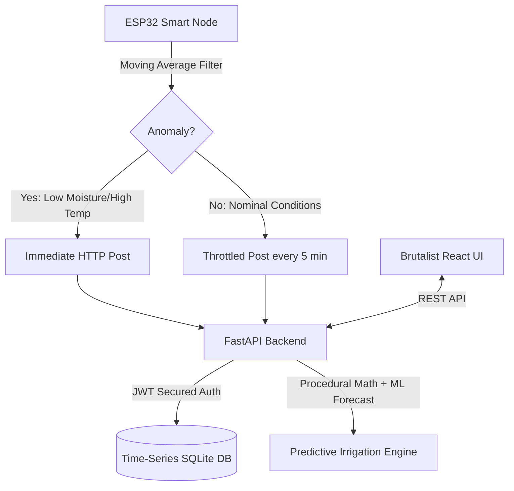

# Smart Agri-Monitor & Optimization System

[](https://opensource.org/licenses/MIT)
[](https://fastapi.tiangolo.com/)
[](https://react.dev/)
[](https://scikit-learn.org/)

An IoT-powered smart irrigation and precision agriculture system designed to monitor soil health, ambient variables, and run predictive machine learning algorithms to optimize watering schedules. It is custom-built to align with **Turkey's Agri-Tech Modernization and Water Resilience priorities for 2026**.

---

## 🏗️ System Architecture

Our system is structured into three highly optimized components:
1. **ESP32 Edge Processing (Firmware)**: Polls high-frequency sensors, cleans noise using a sliding window moving average, and triggers immediate alarms if a drought or thermal anomaly occurs. Otherwise, it throttles transmissions to conserve energy.
2. **FastAPI Robust Backend (Python / SQLite)**: Provides secure multi-tenant farm authentication, manages time-series telemetry streams, and serves the dual-mode irrigation predictive engine.
3. **Brutalist React Dashboard (TypeScript / Vanilla CSS)**: A stark, stripped-back, high-performance visual dashboard that emphasizes raw data and actionable insights without visual fluff.



---

## ⚡ The Edge Processing Logic (ESP32 C++)

Instead of flooding the server with raw high-frequency telemetry, the ESP32 performs local computations:
* **Sliding Window Moving Average**: A buffer of $N=10$ continuous sensor samples is kept locally. It smooths out analog sensor noises and transient fluctuations before sending data.
* **Adaptive Telemetry Throttling**:
  * **Nominal mode**: Data is processed and transmitted at a power-saving interval (e.g., every 5 minutes).
  * **Emergency mode**: If soil moisture drops below critical levels ($< 15.0\%$) or temperature indicates heat-stress ($> 45.0^\circ\text{C}$), the node immediately bypasses the sleep cycle to transmit an anomaly alert.

### ESP32 Pin Connections & Schematic

```
             ┌───────────────────────────────┐
             │            ESP32              │
             │                               │
             │  3.3V ─── [VCC Soil/pH/DHT]   │
             │  GND  ─── [GND Soil/pH/DHT]   │
             │  GPIO34 ─ [Signal Soil Moist] │
             │  GPIO35 ─ [Signal pH Probe]   │
             │  GPIO32 ─ [Signal DHT22 Temp] │
             └───────────────────────────────┘
```

---

## 🧮 Mathematical & Predictive Irrigation Models

The **Predictive Irrigation Engine** supports two operational modes:

### 1. Procedural Evapotranspiration Model (Hargreaves Equation)
Estimates the Reference Evapotranspiration ($ET_0$) in millimeters per day based on ambient temperature and relative humidity:

$$ET_0 = 0.0023 \cdot (T_{\text{mean}} + 17.8) \cdot (T_{\text{max}} - T_{\text{min}})^{0.5} \cdot R_a$$

We approximate the diurnal evapotranspiration rate dynamically using real-time node temperatures and relative humidity ($RH$):

$$\text{Humidity Factor} = 1.0 - \frac{RH}{100.0}$$

$$\text{Watering Duration} = (\text{Target Moisture} - \text{Current Moisture}) \cdot C_{\text{soil}} \cdot (1.0 + ET_0 \cdot 0.1)$$

### 2. Machine Learning Predictive Model
Integrates weather forecast APIs (diurnally simulated in this framework). We train a **Scikit-Learn Random Forest Regressor** using:
* `current_soil_moisture`
* `temperature`
* `humidity`
* `ph`
* `precipitation_probability`
* `cloud_cover`

**Water Resilience Feature**: If the 3-day weather forecast indicates a high probability of rain ($&gt;70\%$), the ML engine preemptively cuts irrigation by **90%**, or **50%** for moderate probability, preserving regional water reservoirs.

---

## 🚀 Installation & Running Locally

### Prerequisites
* Python 3.10+ (Tested up to Python 3.14)
* Node.js v18+ & npm

### 1. Set Up Backend
```bash
# Navigate to backend directory
cd backend

# Create virtual environment and activate
python3 -m venv venv
source venv/bin/activate  # On Windows: venv\Scripts\activate

# Install requirements
pip install --prefer-binary -r requirements.txt

# Run tests to verify the setup
python tests.py -v

# Start FastAPI server
uvicorn main:app --reload --port 8000
```
The backend API documentation will be available at [http://127.0.0.1:8000/docs](http://127.0.0.1:8000/docs).

### 2. Set Up Frontend Dashboard
```bash
# Open a new terminal and navigate to frontend directory
cd frontend

# Install Node dependencies
npm install

# Run Vite dev server (proxies API requests to 127.0.0.1:8000 automatically)
npm run dev
```
Open [http://localhost:5173](http://localhost:5173) in your browser.

### 3. Run ESP32 Telemetry Simulator
```bash
# Open a new terminal, navigate to firmware, and activate venv
cd firmware
source ../venv/bin/activate

# Start the simulator to feed real-time physics data into the system
python simulator.py
```

*Note: Register an account, create a farm, and add a device on the React UI first. Copy the generated `api_key` and paste it into the `DEVICE_NODES` array inside `firmware/simulator.py` to stream live data.*

---

## 📈 Sustainable Impact

By using localized weather predictions and soil moisture telemetry, smart farms achieve:
* **Up to 25% Reduction** in total water usage.
* **Higher Yields** by preventing soil acidification and high-temperature crop stress.
* **Edge Bandwidth Savings** of over **90%** by relying on moving-average buffers and throttled nominal reporting.

---

## 📄 License
This project is licensed under the MIT License - see the [LICENSE](LICENSE) file for details.
