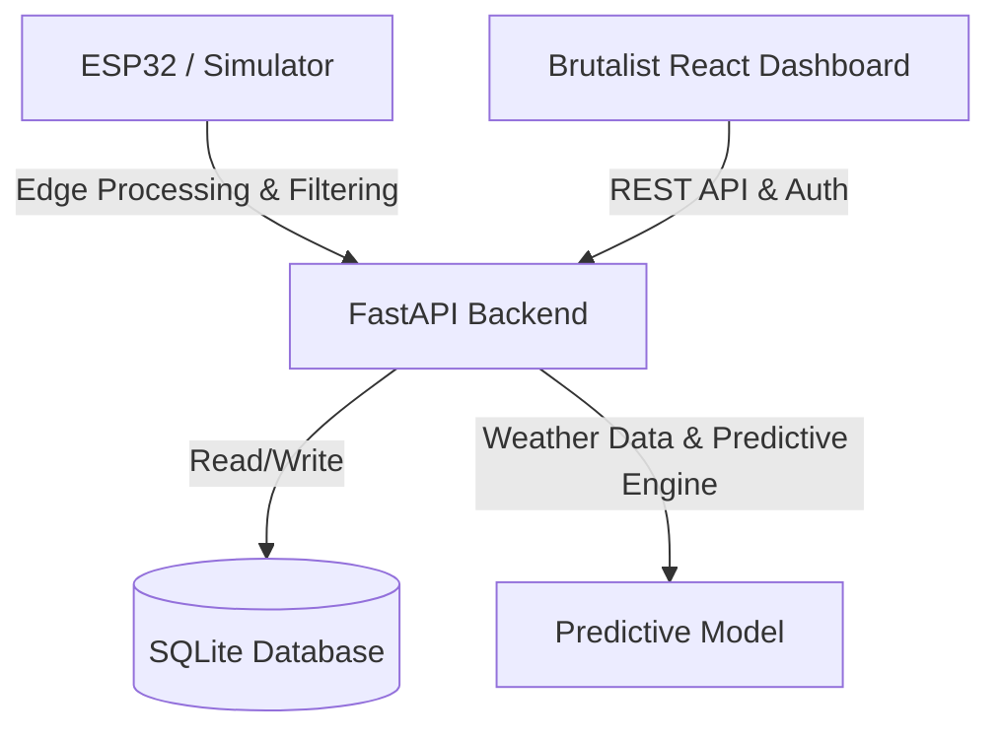

# Implementation Plan - Smart Agri-Monitor & Optimization System

Develop an IoT-based precision irrigation and soil health monitoring system featuring an ESP32 firmware module (with edge filtering), a FastAPI backend (with secure authentication, time-series data storage, and a predictive watering model), and a brutalist React/TypeScript dashboard displaying high-performance metrics.

---

## Proposed System Architecture

---

## User Review Required

> [!IMPORTANT]
> - **Edge Simulator**: Since we are developing this on a server environment, we will include a Python-based ESP32 telemetry simulator to stream mock sensor data (Soil Moisture, pH, Temperature, Humidity) to the backend. We will also write the fully documented Arduino/ESP32 C++ source code.
> - **Brutalist Style**: We will use Vanilla CSS for the React dashboard to build a striking "minimalist/brutalist" interface. This means heavy borders, monospace typography, stark contrasts, and strict grid layouts (no fluff, high performance).
> - **Predictive Analytics**: We will implement a dual-mode predictive watering model:
>   1. **Procedural Math (Evapotranspiration)**: Calculating crop water requirements based on temperature, humidity, and soil characteristics.
>   2. **Predictive ML (Scikit-Learn)**: A simple machine learning model (e.g., Random Forest or Linear Regression) that incorporates 3-day weather forecasts to preemptively reduce watering duration if rain is expected.

---

## Proposed Changes

### Component 1: Firmware & Simulation (`firmware/`)
This module handles hardware telemetry collection and edge computing to save bandwidth.

#### [NEW] [smart_irrigation_sensor.ino](file:///Users/aibek/Desktop/projects/Smart%20Agri-Monitor%20%26%20Optimization%20System/firmware/smart_irrigation_sensor.ino)
- **Features**:
  - Read analog/digital pins for Soil Moisture, pH, Temperature, and Humidity.
  - **Edge Processing**: Perform local filtering using a moving average window of 10 samples to smooth high-frequency noise.
  - **Anomaly Detection**: Compare values against historical baseline thresholds. If an anomaly occurs (e.g., rapid water depletion or temperature spike), immediately trigger an alert payload. Otherwise, send average metrics at a throttled interval (e.g., every 5 minutes).
  - Securely post JSON telemetry to the backend API.

#### [NEW] [simulator.py](file:///Users/aibek/Desktop/projects/Smart%20Agri-Monitor%20%26%20Optimization%20System/firmware/simulator.py)
- **Features**:
  - Multi-device simulation (creates telemetry streams for multiple farms/nodes).
  - Simulates dynamic environmental effects: watering increases soil moisture, daytime increases temperature/reduces humidity, weather trends affect ambient metrics.
  - Transmits data to the local FastAPI backend.

---

### Component 2: FastAPI Backend (`backend/`)
The server provides JWT-based multi-tenant authentication, telemetry persistence, weather integration, and watering scheduling.

#### [NEW] [requirements.txt](file:///Users/aibek/Desktop/projects/Smart%20Agri-Monitor%20%26%20Optimization%20System/backend/requirements.txt)
- Dependencies: `fastapi`, `uvicorn`, `sqlalchemy`, `pydantic`, `pyjwt`, `passlib`, `bcrypt`, `scikit-learn`, `pandas`, `numpy`, `requests`.

#### [NEW] [models.py](file:///Users/aibek/Desktop/projects/Smart%20Agri-Monitor%20%26%20Optimization%20System/backend/models.py)
- **Database Schema**:
  - `User`: ID, username, hashed_password, role.
  - `Farm`: ID, name, location, user_id (foreign key).
  - `Device`: ID, name, status, farm_id (foreign key), api_key.
  - `Telemetry`: ID, device_id, timestamp (indexed for time-series queries), soil_moisture, ph, temperature, humidity, is_anomaly.
  - `WateringLog`: ID, device_id, scheduled_time, duration_seconds, status, manual_override (boolean).

#### [NEW] [database.py](file:///Users/aibek/Desktop/projects/Smart%20Agri-Monitor%20%26%20Optimization%20System/backend/database.py)
- SQLAlchemy connection setup. SQLite with indexing is optimized for local testing of time-series telemetry.

#### [NEW] [auth.py](file:///Users/aibek/Desktop/projects/Smart%20Agri-Monitor%20%26%20Optimization%20System/backend/auth.py)
- Password hashing using bcrypt, JWT token generation, and Dependency injection for verifying credentials.

#### [NEW] [prediction_engine.py](file:///Users/aibek/Desktop/projects/Smart%20Agri-Monitor%20%26%20Optimization%20System/backend/prediction_engine.py)
- **Irrigation Optimization Model**:
  - Implement a simplified Evapotranspiration model:
    $$\text{Water Needed} = \text{Target Moisture} - \text{Current Moisture} + f(\text{Temp}, \text{Humidity})$$
  - Machine learning predictor: Uses a pre-trained or dynamically fitted `scikit-learn` regressor. Features include current soil moisture, pH, current temperature, and simulated weather forecast (cloud cover, probability of precipitation). Outputs expected duration of water valve operation.
  - Weather simulation integration (or free mock external API).

#### [NEW] [main.py](file:///Users/aibek/Desktop/projects/Smart%20Agri-Monitor%20%26%20Optimization%20System/backend/main.py)
- FastAPI entrypoint hosting the routing endpoints:
  - `/api/auth/register`, `/api/auth/login`
  - `/api/farms` (Create/List)
  - `/api/devices` (Register/List)
  - `/api/telemetry` (POST telemetry from ESP32/simulator, GET time-series readings)
  - `/api/predictions/schedule` (GET next watering time and duration recommendation)
  - `/api/predictions/train` (POST trigger model training)

---

### Component 3: Brutalist React Dashboard (`frontend/`)
A stark, brutalist frontend featuring hard contrast, thick black borders, monospace fonts, and absolute clarity of metrics.

#### [NEW] [Vite Configuration & Package JSON](file:///Users/aibek/Desktop/projects/Smart%20Agri-Monitor%20%26%20Optimization%20System/frontend/)
- Scaffolding of React/TypeScript project.

#### [NEW] [index.css](file:///Users/aibek/Desktop/projects/Smart%20Agri-Monitor%20%26%20Optimization%20System/frontend/src/index.css)
- Custom CSS variables for high-contrast colors (e.g., solar yellow, safety orange, stark white, deep charcoal).
- Brutalist custom CSS elements: `border: 4px solid #000; box-shadow: 4px 4px 0px #000; font-family: monospace;`

#### [NEW] [App.tsx](file:///Users/aibek/Desktop/projects/Smart%20Agri-Monitor%20%26%20Optimization%20System/frontend/src/App.tsx) & Dashboard Components
- **Views**:
  - Login / Registration.
  - Farm & Node selector.
  - Multi-node monitoring grid showing live charts (using basic canvas or clean SVG elements to avoid heavy node packages, conforming to brutalist minimalism).
  - Anomaly Feed: Highlights edge computing notifications in neon/orange warning panels.
  - Watering Scheduler & Optimization Dashboard: Shows predictive model recommendation, current weather forecast, and manual override trigger.

---

### Component 4: Documentation & Metadata (`/`)

#### [NEW] [README.md](file:///Users/aibek/Desktop/projects/Smart%20Agri-Monitor%20%26%20Optimization%20System/README.md)
- Complete setup documentation.
- Explanation of the mathematical irrigation logic.
- Details of the ESP32 edge filtering algorithms.
- Hard metrics of water reduction statistics (e.g., simulated impact calculations showing up to 25% water conservation).
- Circuit diagrams in ASCII/Mermaid formats.

---

## Verification Plan

### Automated Tests
1. **Backend Tests**: Create a small script `backend/tests.py` testing database connectivity, auth flows, and the predictive model.
2. **Telemetry Ingest Validation**: Simulate ESP32 posting data and check SQLite storage.

### Manual Verification
1. Run the FastAPI server.
2. Run the simulator script to stream continuous environmental data.
3. Start the Vite React development server and test dashboard authentication, node switching, visual charts, and schedule adjustments in real-time.
